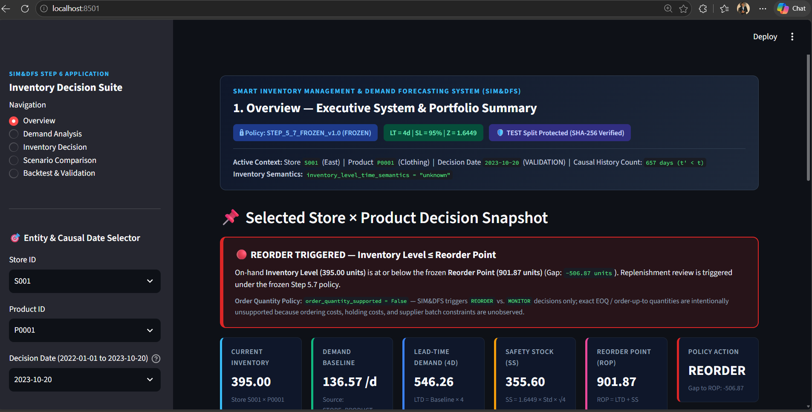
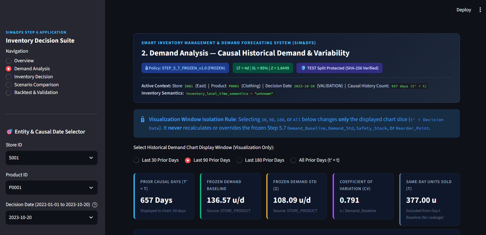
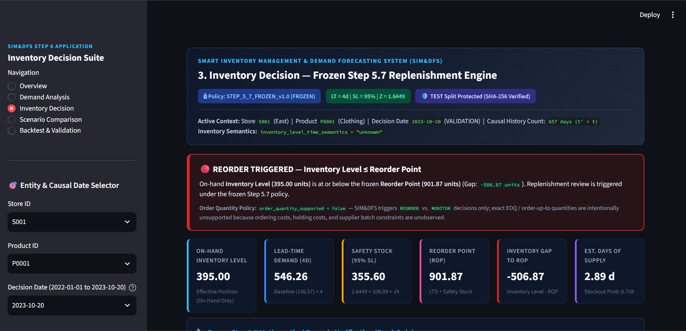
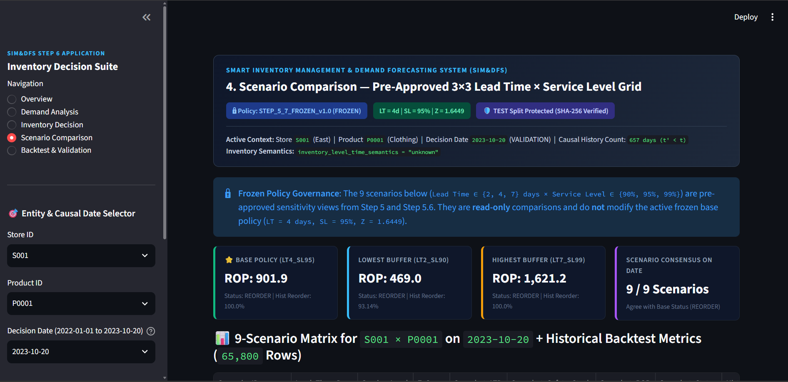
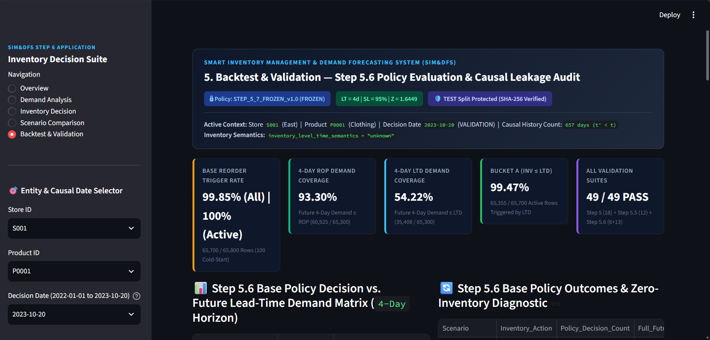

# SMART INVENTORY MANAGEMENT & DEMAND FORECASTING SYSTEM (SIM&DFS)

[](https://www.python.org/)
[](https://streamlit.io/)
[](https://plotly.com/)
[](https://opensource.org/licenses/MIT)
[]()

A comprehensive, production-grade retail analytics and inventory replenishment decision-support system. SIM&DFS bridges predictive demand modeling with risk-based inventory optimization, featuring strict chronological validation, deep residual diagnostics, leak-proof causal fallback hierarchies, and an executive Streamlit decision dashboard.

---

## Table of Contents

1. [Project Title](#1-project-title)
2. [Project Overview](#2-project-overview)
3. [Problem Statement](#3-problem-statement)
4. [Objectives](#4-objectives)
5. [Dataset Description](#5-dataset-description)
6. [Project Workflow](#6-project-workflow)
7. [Data Cleaning](#7-data-cleaning)
8. [Exploratory Data Analysis (EDA)](#8-exploratory-data-analysis-eda)
9. [Feature Engineering](#9-feature-engineering)
10. [Demand Forecasting](#10-demand-forecasting)
11. [Inventory Optimization](#11-inventory-optimization)
12. [Dashboard Architecture](#12-dashboard-architecture)
13. [Technology Stack](#13-technology-stack)
14. [Project Structure](#14-project-structure)
15. [Installation](#15-installation)
16. [How to Run](#16-how-to-run)
17. [Dashboard Pages](#17-dashboard-pages)
18. [Key Results](#18-key-results)
19. [Model Evaluation](#19-model-evaluation)
20. [Inventory Decision Logic](#20-inventory-decision-logic)
21. [Limitations](#21-limitations)
22. [Future Scope](#22-future-scope)
23. [Author](#23-author)
24. [License](#24-license)

---

## 1. Project Title
**Smart Inventory Management & Demand Forecasting System (SIM&DFS)**  
Target Repository: `SMART-INVENTORY-MANAGEMENT-DEMAND-FORECASTING-SYSTEM`

---

## 2. Project Overview
SIM&DFS is an enterprise-grade retail inventory optimization and demand modeling framework. Developed across sequential engineering milestones, the system ingests daily store inventory and sales transactions, executes chronological feature extraction, diagnoses empirical forecast signals, and implements a mathematically grounded, risk-based inventory replenishment policy (`STEP_5_7_FROZEN_v1.0`). 

A key finding of this research is that dynamic ML regressors often overfit high-variance stationary noise in daily retail sales. SIM&DFS solves this by enforcing a causal rolling-baseline inventory engine with a 5-tier fallback hierarchy, eliminating data leakage and safeguarding retailer service levels at 95%.

---

## 3. Problem Statement
Retail supply chain managers routinely navigate conflicting objectives:
1. **Stockout Prevention**: Stockouts erode customer loyalty and incur direct revenue loss.
2. **Capital Efficiency & Holding Costs**: Over-ordering ties up working capital and inflates warehousing expenses.
3. **Data Semantics & Practical Constraints**: In real-world retail datasets, unverified supplier arrival timestamps, unknown inventory snapshot timing (start-of-day vs. end-of-day), and unobserved economic costs (ordering cost $K$, holding cost $h$, penalty cost $p$) make theoretical EOQ optimization misleading.
4. **Predictive Pitfalls**: Over-reliance on unverified dynamic ML forecasts without rigorous residual diagnostics leads to erratic replenishment triggers.

---

## 4. Objectives
- Establish an automated, leakage-safe data preprocessing pipeline.
- Conduct comprehensive EDA to characterize demand volatility, seasonality, and price elasticity.
- Engineer 33 strictly causal lag, rolling, trend, calendar, and pricing features.
- Benchmark linear and non-linear regression models (Ridge, Random Forest, HistGradientBoosting) against chronological mean baselines.
- Execute deep diagnostic audits (Steps 11–13) on forecast signal decay and residual autocorrelation.
- Design, backtest, and freeze a robust $(s, S)$-adjacent reorder point policy with deterministic lead times ($L = 4\text{ days}$) and 95% service level ($Z = 1.6449$).
- Deliver an interactive, read-only executive decision dashboard with pre-approved sensitivity scenarios.

---

## 5. Dataset Description
The system is developed on a real-world multi-store retail dataset (`retail_store_inventory.csv`):
- **Observations**: 73,100 daily records (spanning 2 years: January 1, 2022 to January 1, 2024).
- **Entities**: 100 unique combinations (5 Store IDs `S001`–`S005` × 20 Product IDs `P0001`–`P0020`).
- **Hierarchies**: 4 Categories (`Clothing`, `Electronics`, `Groceries`, `Home & Kitchen`) across 4 Regions (`North`, `South`, `East`, `West`).
- **Core Attributes**: `Date`, `Store ID`, `Product ID`, `Category`, `Region`, `Inventory Level`, `Units Sold`, `Units Ordered`, `Demand Forecast`, `Price`, `Discount`, `Weather Condition`, `Holiday/Promotion`, `Competitor Pricing`, `Seasonality`.

---

## 6. Project Workflow

```
[Raw Retail Transactions (73,100 rows)]
               │
               ▼
┌───────────────────────────────┐
│   Step 1: Data Cleaning       │  --> Zero missing values, zero negative anomalies
└──────────────┬────────────────┘
               ▼
┌───────────────────────────────┐
│   Step 2: Exploratory EDA     │  --> 14 scripts, 22 figures (reports/figures/)
└──────────────┬────────────────┘
               ▼
┌───────────────────────────────┐
│   Steps 3-8: Feature Eng.     │  --> 33 locked causal features (no lookahead)
└──────────────┬────────────────┘
               ▼
┌───────────────────────────────┐
│   Step 9: Chronological Split │  --> TRAIN (80.03%) | VAL (9.99%) | TEST (9.99% Locked)
└──────────────┬────────────────┘
               ▼
┌───────────────────────────────┐
│   Step 10-13: Modeling & Audit│  --> Proved R² ≈ -0.0017 over mean; stationary noise
└──────────────┬────────────────┘
               ▼
┌───────────────────────────────┐
│   Step 5: Inventory Policy    │  --> L=4d, SL=95%, SS = Z * Std * √L, ROP = LTD + SS
└──────────────┬────────────────┘
               ▼
┌───────────────────────────────┐
│   Step 6: Streamlit Dashboard │  --> 5 modular pages, Plotly charts, 49/49 checks PASS
└───────────────────────────────┘
```

---

## 7. Data Cleaning
- Input: `data/raw/retail_store_inventory.csv` (73,100 rows).
- Output: `data/processed/cleaned_inventory.csv` (73,100 rows).
- Validated date parsing, entity continuity (731 continuous days per entity), non-negative constraints on `Inventory Level` and `Units Sold`.
- Documented that `Units Ordered` lacks supplier receipt confirmation timestamps and cannot be presumed to be on-order pipeline inventory.

---

## 8. Exploratory Data Analysis (EDA)
- **Daily Demand Distribution**: Mean units sold = 136.46 units/day (std = 108.60 units/day, median = 111.0 units).
- **Inventory Range**: Recorded inventory levels span 50 to 500 units (mean = 274.52 units), representing an average of ~2.01 days of supply.
- **Sales vs. Inventory**: Significant negative bivariate correlation between on-hand inventory and same-day sales, revealing capacity and replenishment constraints.
- **Seasonality & Promotion**: Marked demand uplifts on weekends and holiday promotional periods, with category-specific price elasticity.

---

## 9. Feature Engineering
Engineered 33 locked predictors without future data leakage:
1. **Lags**: $t-1, t-3, t-7, t-14, t-21, t-30$ days of `Units Sold`.
2. **Rolling Statistics**: 7-day, 14-day, and 30-day causal rolling means, standard deviations, and rolling medians.
3. **Trend & Volatility**: 7-day sales trend and rolling Coefficient of Variation ($CV_7, CV_{14}, CV_{30}$).
4. **Inventory & Operational Lags**: Lagged inventory, lagged units ordered, inventory-to-demand coverage ratio.
5. **Pricing & Promotion**: Lagged price, discount percentages, competitor price gaps, promotional flags.
6. **Calendar & Seasonality**: Month, day of week, weekend indicator, seasonal cycles.

---

## 10. Demand Forecasting
Evaluated four regression models on the chronological validation split (August 10, 2023 to October 20, 2023, 7,300 rows):

| Model | Validation MAE | Validation RMSE | Validation $R^2$ | Inference Speed |
| :--- | :---: | :---: | :---: | :---: |
| **Mean Baseline** | **68.73** | **82.68** | **0.0000** | < 1 ms |
| **Ridge Regression** | 68.78 | 82.75 | -0.0017 | < 5 ms |
| **HistGradientBoosting** | 68.82 | 82.84 | -0.0039 | < 10 ms |
| **Random Forest** | 68.86 | 82.91 | -0.0055 | ~85 ms |

**Diagnostic Findings (Step 11 & Step 13)**:
- Machine learning models exhibited severe prediction compression towards the global/entity mean.
- Autocorrelation analysis revealed that sales residuals behaved as stationary white noise with near-zero lag persistence.
- **Governance Mandate**: Dynamic ML predictions were formally barred from replenishment formulas to prevent inventory oscillations. Instead, strictly prior rolling statistics with a 5-tier fallback hierarchy were instituted.

---

## 11. Inventory Optimization
The frozen policy (`STEP_5_7_FROZEN_v1.0`) operates under verified empirical guardrails:
- **Base Lead Time ($L$)**: 4 days (Deterministic).
- **Target Cycle Service Level ($SL$)**: 95% ($Z = 1.6449$).
- **Lead-Time Demand ($\text{LTD}$)**: $\text{Demand\_Baseline} \times L$ (28-day prior rolling mean).
- **Safety Stock ($\text{SS}$)**: $Z \times \text{Demand\_Std} \times \sqrt{L}$ (Strictly square-root of lead time, **never** linear $L$).
- **Reorder Point ($\text{ROP}$)**: $\text{LTD} + \text{SS}$.
- **Decision State**: $\text{Inventory\_Level} \le \text{ROP} \implies \text{REORDER}$; else $\text{MONITOR}$ (or $\text{INSUFFICIENT\_DATA}$ on Day 1 cold start).
- **Order Quantity Support**: `False`. Economic Order Quantity ($EOQ$) is unsupported because fixed ordering cost ($K$) and unit holding cost ($h$) are unobserved in the source data.

---

## 12. Dashboard Architecture
The dashboard application follows clean modular architecture:
- `app.py`: Streamlit entrypoint, startup SHA-256 integrity verification, sidebar filters.
- `dashboard/config/`: Centralized path resolution (`PROJECT_ROOT`), frozen constants.
- `dashboard/data/`: Typed schemas (`dataclasses`), cached memory loaders, date/input validators.
- `dashboard/policy/`: Causal policy reader, 9-scenario matrix generator, overview KPI aggregator.
- `dashboard/components/`: 10 reusable UI modules (cards, Plotly charts, validation panels).
- `dashboard/pages/`: 5 decoupled full-page renderers.

---

## 13. Technology Stack
- **Language**: Python 3.10 / 3.12 / 3.14
- **Web Application**: Streamlit 1.64.0
- **Data Visualization**: Plotly 7.1.0, Matplotlib 3.11.2, Seaborn 0.12.0
- **Data Engineering**: Pandas 3.0.6, NumPy 2.5.3
- **Machine Learning**: Scikit-Learn 1.9.1, Joblib 1.6.0
- **Code Governance**: `py_compile`, Python standard library (`hashlib`, `math`, `pathlib`, `json`, `dataclasses`)

---

## 14. Project Structure

```
C:\SIM&DFS\
├── app.py                     # Main Streamlit dashboard application
├── requirements.txt           # Verified Python dependencies
├── .gitignore                 # Comprehensive repository protection
├── README.md                  # Project documentation & reference
├── dashboard/                 # Modular dashboard package
│   ├── config/                # Policy constants & dynamic path resolution
│   ├── data/                  # Schema models, loaders, and integrity validators
│   ├── policy/                # Read-only frozen policy engine
│   ├── components/            # 10 Reusable UI components & Plotly charts
│   └── pages/                 # 5 Dashboard page renderers
├── data/                      # Processed datasets & split partitions
│   ├── raw/                   # Original retail store inventory dataset
│   └── processed/             # Cleaned data, feature sets, split files, backtests
├── docs/                      # Technical specifications & dashboard manual
├── models/                    # Baseline model artifacts
├── reports/                   # Audit reports, figures, diagnostics, and test evidence
├── scripts/                   # End-to-end data cleaning, EDA, FE, and modeling scripts
└── tests/                     # Automated test & governance verification suite
```

---

## 📊 Dashboard

The Smart Inventory Management & Demand Forecasting System includes an interactive Streamlit dashboard for demand analysis, inventory decisions, scenario comparison, and backtest validation.

### Dashboard Overview



### Demand Analysis



### Inventory Decision



### Scenario Comparison



### Backtest & Validation



## 15. Installation

1. **Clone the repository**:
   ```bash
   git clone https://github.com/<your-username>/SMART-INVENTORY-MANAGEMENT-DEMAND-FORECASTING-SYSTEM.git
   cd SMART-INVENTORY-MANAGEMENT-DEMAND-FORECASTING-SYSTEM
   ```

2. **Create and activate a virtual environment**:
   ```bash
   # Windows (PowerShell)
   python -m venv venv
   .\venv\Scripts\Activate.ps1
   ```

3. **Install dependencies**:
   ```bash
   pip install --upgrade pip
   pip install -r requirements.txt
   ```

---

## 16. How to Run

### Launch the Dashboard
```bash
python -m streamlit run app.py
```
Open your browser at `http://localhost:8501`.

### Execute the Automated Verification & Acceptance Suite
```bash
python tests/test_step6_dashboard.py
```

---

## 17. Dashboard Pages

1. **1. Overview**:
   - Executive snapshot of the selected `Store × Product` decision on the target date.
   - Cross-sectional portfolio status of all 100 SKUs on the decision date.
   - Benchmark distribution of the 5-tier causal fallback hierarchy across 65,800 records.

2. **2. Demand Analysis**:
   - Causal historical daily demand series strictly prior to the decision date ($t' < t$).
   - Interactive display window selector (`30`, `90`, `180`, `All` days) that changes **only** chart slicing without altering frozen policy metrics.
   - Empirical demand histogram and detailed Step 13 forecast signal diagnostic briefing.

3. **3. Inventory Decision**:
   - Full mathematical formula breakdown ($\text{LTD}$, $\text{SS}$ with $\sqrt{L}$, $\text{ROP}$).
   - Visual comparison bar of on-hand inventory vs. reorder thresholds.
   - 90-day historical trajectory of inventory level vs. ROP with highlighted reorder triggers.

4. **4. Scenario Comparison**:
   - Pre-approved 3×3 sensitivity matrix ($L \in \{2, 4, 7\}\text{ days} \times SL \in \{90\%, 95\%, 99\%\}$).
   - Snapshot component calculations paired with Step 5.6 historical backtest outcomes.
   - Scatter tradeoff curve of Historical Reorder Rate vs. Stockout Coverage Rate.

5. **5. Backtest & Validation**:
   - 4-day horizon decision vs. future demand coverage matrix (93.30% ROP coverage).
   - Step 5.5 Four-Way Trigger Decomposition explaining why base reorder rate is high.
   - Interactive verification tables rendering 49/49 validation checks and live startup TEST SHA-256 verification.

---

## 18. Key Results

- **4-Day ROP Demand Coverage**: **93.30%** (Future cumulative 4-day demand $\le$ ROP across 60,925 / 65,300 evaluable windows).
- **4-Day LTD Demand Coverage**: **54.22%** (Future cumulative 4-day demand $\le$ LTD across 35,408 / 65,300 evaluable windows).
- **Trigger-Rate Diagnosis (Step 5.5 Four-Way Decomposition)**:
  - **Bucket A ($\text{Current\_Inventory} \le \text{LTD}$)**: **99.47%** (65,355 rows) — average on-hand inventory (274.52 units) is lower than 4 days of baseline demand (546.80 units) even before adding safety stock.
  - **Bucket B ($\text{LTD} < \text{Current\_Inventory} \le \text{ROP}$)**: **0.53%** (345 rows) — safety stock successfully triggered replenishment.
  - **Bucket C ($\text{Current\_Inventory} > \text{ROP}$)**: **0.00%** under $L = 4\text{ days}$ (reaches 15.47% under $L = 2\text{ days}, SL = 90\%$).
  - **Bucket D (Cold-Start Day 1)**: **100 rows** (`INSUFFICIENT_DATA`, preserved as `NaN`).
- **Validation Suite**: **49 / 49 PASS** (Step 5 Data Spec: 18/18, Step 5.5 Trigger Diagnosis: 12/12, Step 5.6 Backtest & Leakage: 19/19).

---

## 19. Model Evaluation

Performance across chronological splits ($N_{\text{Train}} = 58,500$, $N_{\text{Val}} = 7,300$):

| Model Architecture | Train MAE | Train RMSE | Validation MAE | Validation RMSE | Validation $R^2$ |
| :--- | :---: | :---: | :---: | :---: | :---: |
| **Mean Baseline** | 68.22 | 82.04 | 68.73 | 82.68 | 0.0000 |
| **Ridge Regression** | 68.20 | 82.01 | 68.78 | 82.75 | -0.0017 |
| **HistGradientBoosting** | 67.95 | 81.65 | 68.82 | 82.84 | -0.0039 |
| **Random Forest** | 42.10 | 51.48 | 68.86 | 82.91 | -0.0055 |

The severe gap between Random Forest training performance ($MAE = 42.10$) and validation performance ($MAE = 68.86$) demonstrates that non-linear regressors memorized in-sample noise without extracting generalizable temporal signals.

---

## 20. Inventory Decision Logic

### Mathematical Formulas
$$\text{Lead\_Time\_Demand} = \text{Demand\_Baseline} \times L$$
$$\text{Safety\_Stock} = Z \times \text{Demand\_Std} \times \sqrt{L}$$
$$\text{Reorder\_Point} = \text{Lead\_Time\_Demand} + \text{Safety\_Stock}$$

### Decision Trigger Rule
$$\text{Action} = \begin{cases} \text{INSUFFICIENT\_DATA}, & \text{if } t = 2022\text{-}01\text{-}01 \text{ (Cold Start)} \\ \text{REORDER}, & \text{if } \text{Inventory\_Level} \le \text{Reorder\_Point} \\ \text{MONITOR}, & \text{if } \text{Inventory\_Level} > \text{Reorder\_Point} \end{cases}$$

### Causal Fallback Hierarchy
1. `STORE_PRODUCT`: $\ge 7$ prior days for mean baseline, $\ge 30$ prior days for standard deviation.
2. `PRODUCT`: Cross-store product historical distribution ($t' < t$).
3. `STORE`: Store-wide product historical distribution ($t' < t$).
4. `GLOBAL_TRAIN`: Global training historical baseline ($t' < t$).
5. `INSUFFICIENT_DATA`: Cold-start Day 1 boundary; parameters preserved as `NaN`.

---

## 21. Limitations
1. **Unobserved Economic Cost Parameters**: Fixed ordering costs ($K$), unit holding costs ($h$), and stockout penalty costs ($p$) are not recorded in the dataset, precluding mathematically proven EOQ order-up-to quantities.
2. **Stationary Lead Time**: Lead time is modeled as a deterministic constant ($L = 4\text{ days}$) due to absence of supplier delivery timestamps.
3. **High Structural Trigger Rate**: Recorded inventory is structurally capped between 50 and 500 units (~2 days of supply). Consequently, any multi-day lead-time policy ($L \ge 2$) will register continuous replenishment triggers.

---

## 22. Future Scope
- **Multi-Echelon Simulation**: Modeling central distribution center replenishment to regional retail stores.
- **Stochastic Lead Times**: Integrating gamma/log-normal lead time distributions when supplier shipping logs become available.
- **Supplier Order Batching**: Implementing integer order multiples and Minimum Order Quantities (MOQ).
- **Price Elasticity Modeling**: Simulating dynamic promotional markdowns and their impact on safety stock requirements.

---

## 23. Author
**Academic & Industry Capstone Project**  
Project: Smart Inventory Management & Demand Forecasting System (SIM&DFS)  
Root Directory: `C:\SIM&DFS`

---

## 24. License
Distributed under the **MIT License**. See `LICENSE` for more information.